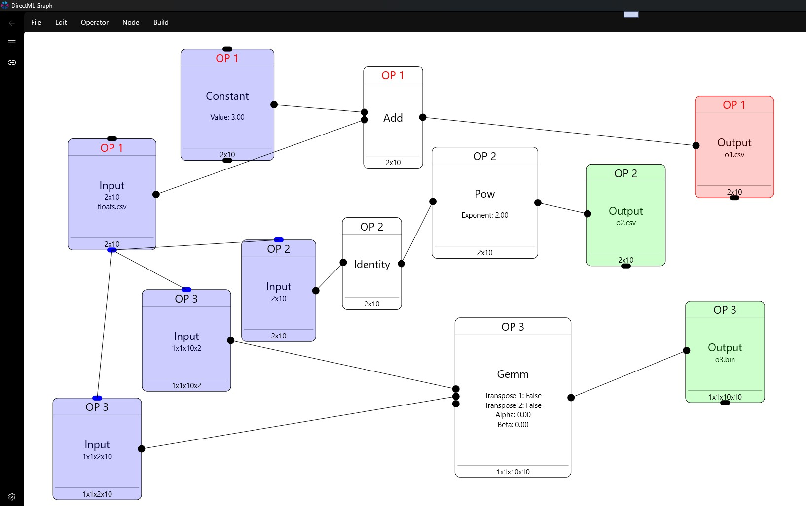

# DirectML Graph

A tool to visually-design DirectML operators that run in the GPU.

# Supported Operators

A: Abs,ACos,ACosh,Add,ASin,ASinh,ATan,ATanh,ATanYX

B: BitAnd, BitCount, BitOr, BitNot, BitShiftLeft, BitShiftRight, BitXor

C: Ceil, Clip, Cos, Cosh

N: Neg

# Pending

All other operators, casts

