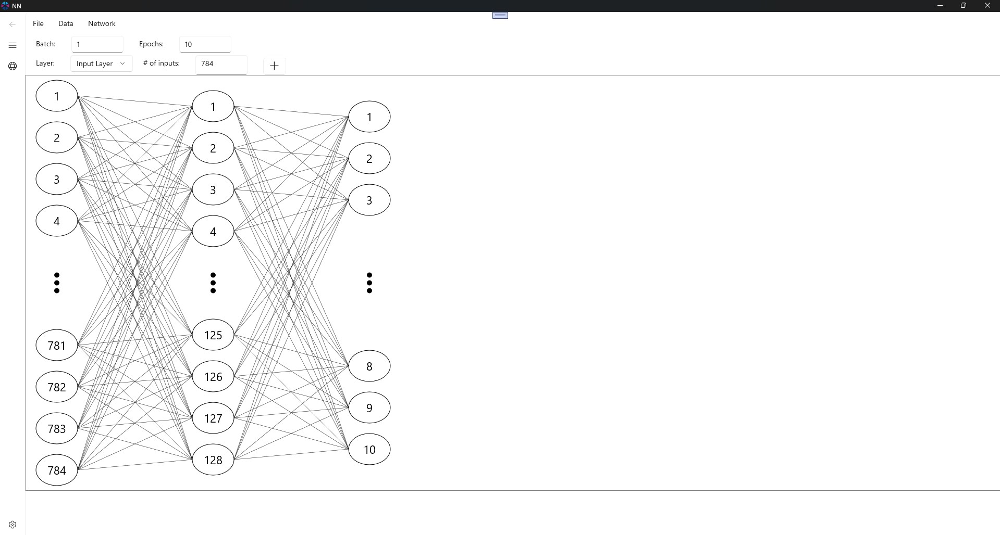

# Visual DML

A tool to visually-design DirectML operators that run in the GPU and to create and train a neural network with it.
Uses my [DirectML Lib](https://github.com/WindowsNT/directmllib).

Download also binary from <a href="https://apps.microsoft.com/detail/9PP77DNJ0B8B?hl=en-us&gl=GR&ocid=pdpshare">Windows App Store</a>

## Features for DirectML Design

* Undo, Redo, Save, Load, Multiple Sets
* Multiple Visible/Active DirectML operators
* Direct2D Drawing
* Memory Sharing
* Input/Output CSV or binary, Input Random, Output to MessageBox
* Adapter Selection
* Show Adapter Memory Consumed
* Variables
* Generate C++ Code and VS Solution

## Features for NN design

* Design a neural network
* MNIST-included dataset
* Adapter Selection
* Training on GPU
* Training on CPU
* Testing on GPU/CPU
* Batch training
* Saving/Loading model
* Saving as PTH or ONNX with Python installed
* Customizable network structure
* Customizable activation functions

## Supported DirectML Operators

* Activation: Celu,Elu,Gelu,HardMax,HardSigmoid,Identity,LeakyRelu,Linear,LogSoftmax,ParameterizedRelu,ParametricSoftplus,Relu,ScaledElu,ScaledTanh,Shrink,Sigmoid,Softmax,Softplus,Softsign,Tanh,ThresholdedRelu
* Batch Processing: BatchNormalization, BatchNormalizationGrad, BatchNormalizationTraining, BatchNormalizationTrainingGrad
* Comparison Operators: If, IsInfinity, IsNaN
* A: Abs,ACos,ACosh,Add,And,ASin,ASinh,ATan,ATanh,ATanYX,AveragePooling
* B: BitAnd, BitCount, BitOr, BitNot, BitShiftLeft, BitShiftRight, BitXor
* C: Cast, Ceil, Clip, ClipGrad, Constant, ConvolutionInteger, Cos, Cosh, Cummulative Sum/Product, Convolution
* D: DepthToSpace, Dequantize, DequantizeLinear, DiagonalMatrix, DifferenceSquare, Divide
* E: Erf, Exp, Equals
* F: Floor
* G: Gather, GatherElemends, GatherND, Gemm, GreaterThan, GreaterThanOrEqual, Gru
* I: Identity, 
* J: Join
* L: Log, LessThan, LessThanOrEqual, LocalResponseNormalization
* M: Max,MaxPooling,Mean,MeanVarianceNormalization,Min,Multiply,Modulus Floor,Modulus Truncate
* N: Neg, NonZeroCoordinates, Not
* O: OneHot, Or
* P: Padding, Pow
* Q: QuantizedLinearConvolution, QuantizeLinear
* R: RandomGenerator, Recip, Reduce, Resample, ResampleGrad, Round, RoiAlign, RoiAlignGrad, Reintrerpret, ReverseSubsequences
* S: ScatterElements, Slice, SliceGrad, Subtract, Sqrt, Sign, SpaceToDepth
* T: Threshold, TopK
* U: Upsample2D
* V: ValueScale2D 
* X: Xor  

## Screenshots

### ToDo

Complete VS project generation support

Recurrent NN training

Usage of batch DML operations for faster training

Implement Loops

